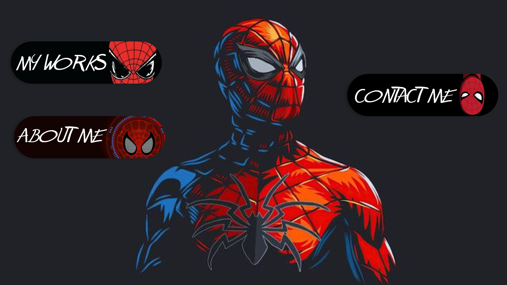

# Portfolio Website

This is a portfolio website I developed for my friend Abdul Haseeb. The website showcases Abdul Haseeb's work and is designed to highlight his skills and projects.

## Demo

You can view the live demo of the website [here](http://abdulhaseeb.atwebpages.com/).

## Contributions

- **UI/UX and Design**: Handled by Abdul Haseeb.
- **Coding**: Developed by me, focusing on implementing the design and functionality.

## Learning Experience

Working on this project has helped me in understanding and communicating effectively with designers. It has helped me to create efficient and pixel-perfect websites by aligning development with design goals.

## Screenshots

Here are some previews of the website:

### Desktop View

  
  

  
  

  
  

## Special Thanks

A special thanks to **Abdul Haseeb** for his collaboration on this project. His design expertise and vision were crucial in making this portfolio website a success.

## License

This project is licensed under a **Proprietary License**. All rights are reserved. You may not use, copy, modify, or distribute this code without explicit permission from the author.
